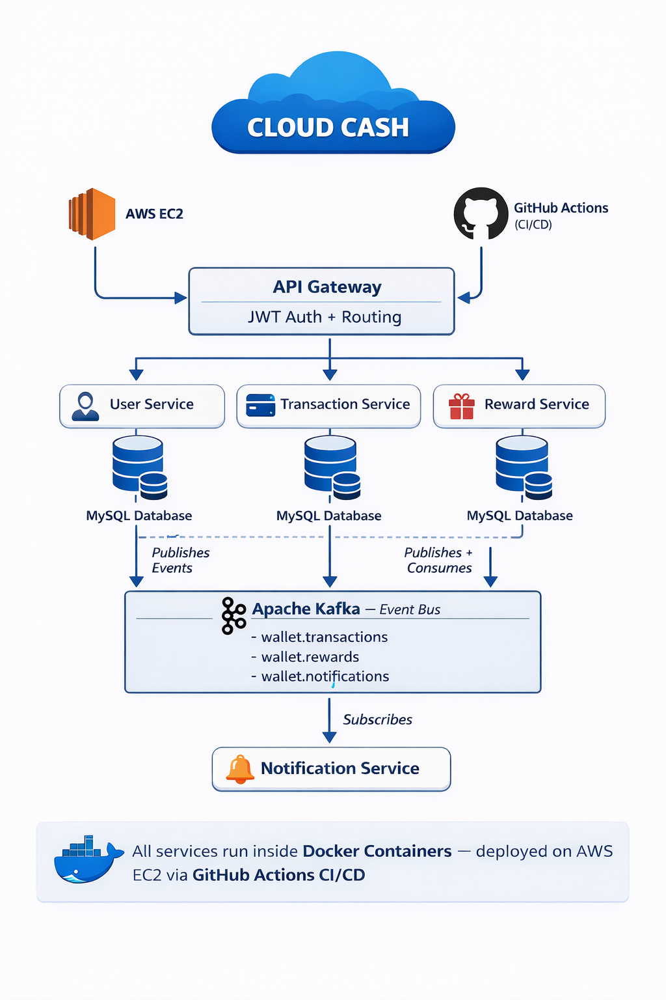

# 💸 CloudCash — Event-Driven Digital Wallet Platform


> A production-grade, microservices-based digital wallet platform built for high-concurrency financial operations — featuring event-driven transaction processing via Apache Kafka, JWT-secured APIs, and fully automated CI/CD deployment on AWS.

---

## 📌 Table of Contents

- [Overview](#overview)
- [Architecture](#architecture)
- [Features](#features)
- [Tech Stack](#tech-stack)
- [Microservices Breakdown](#microservices-breakdown)
- [API Reference](#api-reference)
- [Kafka Event Flow](#kafka-event-flow)
- [Database Schema](#database-schema)
- [Performance & Scalability](#performance--scalability)
- [Security](#security)
- [CI/CD Pipeline](#cicd-pipeline)
- [Getting Started](#getting-started)
- [What I Learned](#what-i-learned)

---

## 🧩 Overview

CloudCash is a **distributed digital wallet system** designed to handle peer-to-peer transfers, wallet management, and rewards processing at scale. The platform was built to solve real-world problems in fintech:

- How do you process thousands of concurrent transactions **without data inconsistency**?
- How do you **decouple services** so one failure doesn't bring down the whole system?
- How do you ensure **exactly-once processing** in an event-driven architecture?

This project answers all three — using Apache Kafka for async event processing, normalized MySQL schemas with ACID transactions, and a microservices architecture with independent deployability.

---

## 🏗️ Architecture

<p align="center">
  
</p>


```
┌─────────────────────────────────────────────────────────────┐
│                        api-gateway                          │
│                   (JWT Auth + Routing)                      │
└──────────┬────────────────────┬────────────────────┬────────┘
           │                    │                    │
    ┌──────▼──────┐    ┌────────▼──────────┐  ┌─────▼──────────┐
    │  user-      │    │  transaction-     │  │  reward-       │
    │  service    │    │  service          │  │  service       │
    └──────┬──────┘    └────────┬──────────┘  └─────┬──────────┘
           │                    │                    │
           └────────────────────┼────────────────────┘
                                │  publishes events
                    ┌───────────▼───────────┐
                    │    Apache Kafka        │
                    │  (Event Bus)           │
                    │  Topics:               │
                    │  - wallet.transactions │
                    │  - wallet.rewards      │
                    │  - wallet.notifications│
                    └───────────┬───────────┘
                                │  subscribes
                    ┌───────────▼───────────┐
                    │  notification-         │
                    │  service               │
                    └───────────────────────┘

        All services → MySQL (individual schemas)
        All services → Docker containers
        Deployed on → AWS EC2
        CI/CD via   → GitHub Actions
```

---

## ✅ Features

| Feature | Description |
|---|---|
| 💼 Wallet Management | Create, view, and manage digital wallets per user |
| 💸 Peer-to-Peer Transfers | Real-time money transfers between wallets |
| 🎁 Rewards Processing | Cashback and rewards applied via Kafka events |
| 📜 Transaction History | Paginated, filterable transaction logs |
| 🔐 JWT Auth + RBAC | Secure endpoints with role-based access control |
| ⚡ Kafka Event Processing | Async, decoupled transaction events with retry |
| 🐳 Dockerized Deployment | All services containerized for easy deployment |
| 🔄 CI/CD Automation | Auto-deploy to AWS EC2 on every push to main |

---

## 🛠️ Tech Stack

| Layer | Technology |
|---|---|
| Language | Java 17 |
| Framework | Spring Boot 3.x, Spring MVC |
| Security | Spring Security, JWT, RBAC |
| Message Broker | Apache Kafka (Consumer Groups, Retry, DLQ) |
| Database | MySQL 8.0 (ACID, Indexed Schemas) |
| ORM | Spring Data JPA, Hibernate |
| Containerization | Docker, Docker Compose |
| CI/CD | GitHub Actions |
| Cloud | AWS EC2 |
| Testing | JUnit, Mockito |
| Logging | SLF4J, Logback |

---

## 🔬 Microservices Breakdown

> **Real project structure:**
> ```
> cloudcash-wallet-microservices/
> ├── api-gateway/
> ├── user-service/
> ├── transaction-service/
> ├── reward-service/
> ├── notification-service/
> └── docker-compose.yml
> ```

### `user-service`
- Handles registration, login, JWT token generation
- Manages user profiles and authentication
- Publishes `user.created` event to Kafka on signup

### `transaction-service`
- Core business logic: wallet creation, balance management, P2P transfers
- Validates sufficient balance before debit using **pessimistic locking**
- Publishes `transaction.completed` and `transaction.failed` events to Kafka
- Owns the `wallets` and `transactions` MySQL tables

### `reward-service`
- Subscribes to `transaction.completed` events from Kafka
- Calculates and applies cashback/reward points asynchronously
- Idempotent processing with deduplication keys to prevent double rewards

### `notification-service`
- Subscribes to all transaction and reward events
- Sends email/in-app notifications to users on every state change
- Uses Kafka consumer group for load balancing across instances

---

## 📡 API Reference

### Auth APIs
```
POST   /api/auth/register          → Register new user
POST   /api/auth/login             → Login and get JWT token
```

### Wallet APIs
```
POST   /api/wallet/create          → Create wallet for user
GET    /api/wallet/{walletId}      → Get wallet details + balance
GET    /api/wallet/all             → Get all wallets (ADMIN only)
```

### Transaction APIs
```
POST   /api/transaction/transfer   → Initiate P2P transfer
GET    /api/transaction/history    → Get paginated transaction history
GET    /api/transaction/{txnId}    → Get specific transaction details
```

### Rewards APIs
```
GET    /api/rewards/balance        → Get current rewards/cashback balance
GET    /api/rewards/history        → Get rewards transaction history
```

---

## 📨 Kafka Event Flow

```
User initiates Transfer
        │
        ▼
Wallet Service validates balance
        │
        ▼
Debit sender + Credit receiver (DB Transaction - ACID)
        │
        ▼
Publish → [wallet.transactions] topic
        │
    ┌───┴────────────────────┐
    ▼                        ▼
Rewards Service          Notification Service
(Apply cashback)         (Send confirmation)
    │
    ▼
Publish → [wallet.rewards] topic
```

**Key Kafka Design Decisions:**
- **Consumer Groups**: Each service has its own consumer group — independent scaling
- **Retry Mechanism**: Failed events retry 3 times with exponential backoff
- **Dead Letter Queue (DLQ)**: Permanently failed events sent to DLQ for manual review
- **Idempotency**: Transaction IDs prevent duplicate processing on redelivery

---

## 🗄️ Database Schema

```sql
-- Wallets Table
CREATE TABLE wallets (
    id          BIGINT PRIMARY KEY AUTO_INCREMENT,
    user_id     BIGINT NOT NULL UNIQUE,
    balance     DECIMAL(15,2) NOT NULL DEFAULT 0.00,
    currency    VARCHAR(10) DEFAULT 'INR',
    status      ENUM('ACTIVE', 'FROZEN', 'CLOSED'),
    created_at  TIMESTAMP DEFAULT CURRENT_TIMESTAMP,
    INDEX idx_user_id (user_id)
);

-- Transactions Table
CREATE TABLE transactions (
    id              BIGINT PRIMARY KEY AUTO_INCREMENT,
    txn_id          VARCHAR(36) NOT NULL UNIQUE,  -- idempotency key
    sender_wallet   BIGINT NOT NULL,
    receiver_wallet BIGINT NOT NULL,
    amount          DECIMAL(15,2) NOT NULL,
    status          ENUM('PENDING', 'SUCCESS', 'FAILED'),
    created_at      TIMESTAMP DEFAULT CURRENT_TIMESTAMP,
    INDEX idx_sender   (sender_wallet),
    INDEX idx_receiver (receiver_wallet),
    INDEX idx_txn_id   (txn_id)
);
```

---

## 📊 Performance & Scalability

| Metric | Result |
|---|---|
| Concurrent transactions simulated | **5,000+** |
| API response time improvement (query optimization) | **~30%** |
| Kafka async processing latency reduction | **~40%** |
| Deployment time reduction via CI/CD | **~70%** |
| System uptime (post-optimization) | **99%+** |

**How concurrency was handled:**
- `transaction-service` uses **pessimistic locking** (`SELECT ... FOR UPDATE`) on wallet balance rows — prevents race conditions under parallel debit requests
- Kafka consumer groups allow **horizontal scaling** of each service independently — add more instances of `notification-service` without touching `transaction-service`
- MySQL indexed schemas keep transaction history queries fast even as rows grow into the millions
- **Idempotency keys** (`txn_id` UUID) ensure exactly-once processing even when Kafka retries deliver an event twice

---

## 🔐 Security

- **JWT Authentication**: Stateless token-based auth with expiry and refresh
- **RBAC**: Role-based access — `ROLE_USER`, `ROLE_ADMIN`
- **Password Hashing**: BCrypt with salt rounds
- **Input Validation**: Bean Validation on all request DTOs
- **Exception Handling**: Global handler — no stack traces exposed to client

---

## 🔄 CI/CD Pipeline

```yaml
# On push to main branch:
1. Code checkout
2. Maven build + run unit tests (JUnit + Mockito)
3. Docker image build
4. Push image to Docker Hub
5. SSH into AWS EC2
6. Pull latest image + restart container
7. Health check verification
```

This reduced manual deployment time by **70%** compared to manual SSH deploys.

---

## 🚀 Getting Started

### Prerequisites
- Java 17+
- Docker & Docker Compose
- Apache Kafka (or use Docker Compose setup below)

### Run Locally

```bash
# Clone the repo
git clone https://github.com/SambhajiShinde13/cloudcash-wallet-microservices.git
cd cloudcash-wallet-microservices

# Start Kafka + MySQL via Docker Compose
docker-compose up -d

# Run the service
./mvnw spring-boot:run
```

### Environment Variables
```env
DB_HOST=localhost
DB_PORT=3306
DB_NAME=cloudcash
DB_USER=root
DB_PASSWORD=yourpassword
KAFKA_BOOTSTRAP_SERVERS=localhost:9092
JWT_SECRET=your_jwt_secret_key
JWT_EXPIRY=86400000
```

---

## 💡 What I Learned

Building CloudCash taught me several real-world distributed systems lessons:

1. **Idempotency is not optional** — Without deduplication keys, Kafka retries caused duplicate credits. Fixed with unique `txn_id` constraints.
2. **Pessimistic locking for financial operations** — Optimistic locking caused race conditions under concurrent transfers. Pessimistic locking on wallet balance solved it.
3. **Dead Letter Queues save production** — Events that fail repeatedly need a place to go, not infinite retries that block the partition.
4. **Environment-based config** — Hardcoded values in Docker images burned me once. Spring profiles + env vars solved it cleanly.

---

## 📬 Contact

**Sambhaji Shinde** — Java Backend Engineer  
📧 sambhajishinde4454@gmail.com  
🔗 [LinkedIn](https://linkedin.com/in/sambhajishinde13) | [GitHub](https://github.com/SambhajiShinde13)